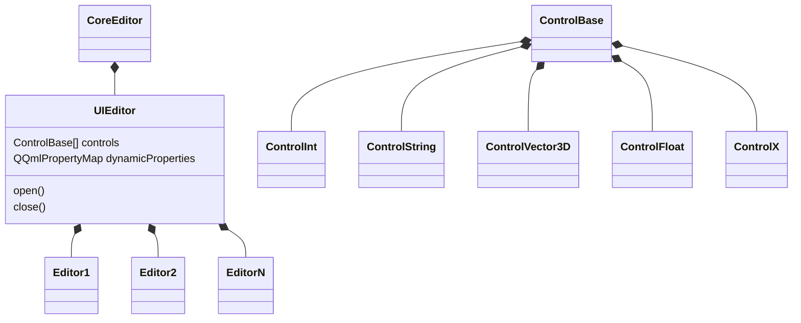
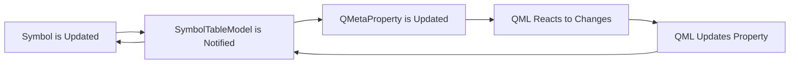
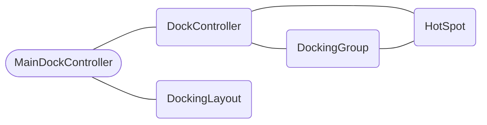

---
# You can also start simply with 'default'
theme: dracula
# random image from a curated Unsplash collection by Anthony
# like them? see https://unsplash.com/collections/94734566/slidev
layout: image
image: ./assets/title-slide.png
# some information about your slides (markdown enabled)
title: The Great Migration
info: |
  QtWS 2025: The Great Migration
# apply unocss classes to the current slide
class: text-center
# https://sli.dev/features/drawing
drawings:
  persist: false
# slide transition: https://sli.dev/guide/animations.html#slide-transitions
transition: slide-left
# enable MDC Syntax: https://sli.dev/features/mdc
mdc: true
# open graph
# seoMeta:
#  ogImage: https://cover.sli.dev
---

<style>
.slidev-code {
    height: 90%;
    overflow-y: scroll;
}
</style>

---

# What is Alias?

<SlidevVideo autoplay controls>
    <source src="/assets/what-is-alias.mp4" type="video/mp4">
</SlidevVideo>

---

# Prologue

- Migrating legacy GUI to Qt/QML
- Pure QML/Qt Quick GUI implementation
- Lots and lots of data to transfer to GUI and back
- Extensive use of an internal data structure that we cannot change

---

# What is the problem we are trying to solve?

- Reduce code bloat
- Improve productivity
- Make our system more configurable

---

# How do we represent data?

---

# Data Representation in the Core

- A `Symbol` is like `QProperty`, a `SymbolTable` is like a `QVariantMap`.

```cpp
SymbolTable data{
    {"degrees", IntSymbol{}},
    {"spans", IntSymbol{}},
    {"value", StringSymbol{}},
    {"calculate", FunctionSymbol{[]() {}}},
};
```

- Data for UI is created procedurally in thousand different places.
```cpp
void create() {
  ControlBox box;
  box.addInt(IntegerSymbol{}, "Degrees"); // Represents an integer input field
  box.addInt(IntegerSymbol{}, "Spans");
  box.addSring(StringSymbol{}, "Value"); // Represents a string input field
  box.addSring(FunctionSymbol{[]() {}}, "calculate");
  box.open();
}
```

---

# Initial Attempt


```mermaid
classDiagram
CoreEditor *-- UIEditor
UIEditor : ControlBase[] controls
UIEditor : QQmlPropertyMap dynamicProperties
UIEditor : open()
UIEditor : close()
UIEditor *-- Editor1
UIEditor *-- Editor2
UIEditor *-- EditorN

ControlBase *-- ControlInt
ControlBase *-- ControlString
ControlBase *-- ControlVector3D
ControlBase *-- ControlFloat
ControlBase *-- ControlX
```

---

```cpp
class Core::MyEditor {
  virtual void open() = 0;
  virtual void close() = 0;
  std::string getData() const;
  void setData(const std::string &data);
};
```

<br>
<br>

<v-click>

```cpp
class UI::MyEditor : public Core::MyEditor {
  void open() final {}
  void close() final{};
  QString getQData() const;
  void setQData(const QString &data);
  QVector<ControlBase*> controls() const;
  QQmlPropertyMap dynamicProperties() const;
};
```

</v-click>

<!--
- When we needed to expose data to UI, we needed to have a class that inherits from the core and
  exposes it.
- We used `QQmlPropertyMap` as well.
- `QQmlPropertyMap`
-->

---

```cpp
class awQuick::ControlColor : public ControlBase {
  Q_PROPERTY(QColor value READ getValue WRITE setValue NOTIFY valueChanged)

public:
  ControlColor(TripleSymbol *symbol, const char *title);
  QColor getValue() const;
  void setValue(QColor val);

signals:
  void valueChanged();

private:
  TripleSymbol *m_sym{nullptr};
  QColor m_color{};
};
```

<!--
- We already had thousands and thousands lines of code that uses this pattern.
- There are editors with thousands, sometimes millions of these calls.
-->

---

# Model/View For UI Controls

```qml
Editor {
    property var editorData

    Repeater {
        model: editorData.controls
        delegate: Loader {
            id: ld

            // Information is lost...
            property var modelData

            // Information is still lost...
            property ControlBase modelData

            // One of many possibilities...
            ColorEditDelegate {
                color: modelData.value
            }
        }
    }
}
```

---

# Getting Additional Data from an Editor

```qml
Editor {
    property var editorData

    // `dynamicProperties` is a `QQmlPropertyMap`
    customProperty: editorData.dynamicProperties.customData
    secondTitle: editorData.dynamicProperties.secondTitle
}
```

---

What happens when we want to call a function from our data table?

<v-click>

```cpp
Q_INVOKABLE void calculate() { m_functionSymbol.invoke(); }

// Or we cal into some virtual method that calls the underlying function symbol
Q_INVOKABLE void calculate() { calculateInternal(); }
```

</v-click>

<v-click>

What happens when you want to just arbitrarily expose function symbols?..

</v-click>

<v-click>

```cpp
Q_INVOKABLE void notFun1() {}
Q_INVOKABLE void notFun2() {}
Q_INVOKABLE void notFun3() {}
Q_INVOKABLE void notFun4() {}
```

</v-click>

<v-click>

What happens when requirements change and we need to expose different things?

</v-click>

<v-click>

```cpp
class awQuick::ControlColor : public ControlBase {
  // ...
  Q_PROPERTY(float newData READ getNewData WRITE setNewData NOTIFY newDataChanged)
};
```

And recompile...

</v-click>

<!--
- We want to do as much work as possible in the core, all the logic stays there. Including opening
  dialogs, updating properties etc.
-->

---

# Cons

- It's hard to use static types
> We have to rely on `var` property type
- Each change requires a re-build
- Lots of virtual interfaces...
- Code bloat
- Function calls has to be converted to `Q_INVOKABLE` methods

<br>

<v-click>

# Pros

- It's C++?..

</v-click>

---

# Realization...

---
layout: center
---


---

# Other Realizations

- Too much boilerplate code to expose data
- Virtual interfaces create a dependency that we don't like
- These data types are generic, what they represent just changes based on context
- The symbols we add to the table might be used for other purposes, so we need more freedom over
  how much we expose
- We want to control all the data flow from a single point
- Our data is like JSON

---

# Enter `QMetaObject` "Abuse"

```cpp
SymbolTable data{
    {"degrees", IntSymbol{32}},
    {"spans", IntSymbol{-1}},
    {"value", StringSymbol{"Timmy!"}},
    {"greet", FunctionSymbol{[]() { std::clog << "Hello all!\n"; }}},
};
```

<br>

```qml
SymbolTableModel {
    property int degrees
    property int spans
    property string value
    property var greet: () => {}
    // Will be possible at some point... QTBUG-104220
    property function greet: () => {}

    Component.onCompleted: {
        console.log(degrees) // Prints "32"
        console.log(spans) // Prints "-1"
        console.log(value) // Prints "Timmy!"
        greet() // Prints "Hello all!"
    }
}
```

---

More complex cases...

<SlidevVideo autoplay controls>
    <source src="/assets/alias-editors.mp4" type="video/mp4">
</SlidevVideo>

---

Here's the data we use to draw those shader balls.

```qml
SymbolTableModel {
    property int width
    property int height
    property bool viewEnabled
    property SymbolTable drawLayers
    property SymbolTableList items
    property SymbolTable mouse
}
```

---

We just expose what we need, no extra code needed to change the data here.

```qml
SymbolTableModel {
    property string title: ""
    property string type: ""
    property bool visible: true
    property bool enabled: true
}
```

```qml
SymbolTableModel {
    property string title: ""
    property string type: ""
}
```

```qml
SymbolTableModel {
    property string title: ""
    property string type: ""
    property int counter: 0
}
```

---

**Supports inheritance**

```qml

// BaseControl.qml
SymbolTableModel {
    property string title: ""
    property string type: ""
}

BaseControl {
    property int counter: 0
}
```

---

**Ability to play with syntax to make exposing data more ergonomic**

```qml
SymbolTableModel {
    property SymbolTableModel view: SymbolTableModel {
        property int width
        property int height
        property SymbolTable drawLayers
    }
}
```

<v-click>

Ability to customize the underlying mechanics of how data is exposed.

```qml
SymbolTableModel {
    // This will create our special `ControlTableList` type internally and append `SymbolTable` types
    // to it.
    property ControlTableList controls
}
```

We use `ControlTableList` to dynamically filter our model based on some conditions.

</v-click>

---

The way the underlying data is expressed is fully customizable.

```qml
SymbolTableModel {
    property Person manager: Person {
        property string name
        // And other related properties...
    }
}
```

---

# How Does It Work?


```mermaid
graph LR;
    A[Symbol is Updated] --> B[SymbolTableModel is Notified];
    B --> C;
    C[QMetaProperty is Updated] --> D[QML Reacts to Changes];
    D --> E;
    E[QML Updates Property] --> B;
    B --> A;

```

<v-click>

````md magic-move
```cpp
// SomeWhereOverTheRainbow.cpp
symbol.notify();
```
```cpp
// SomeWhereOverTheRainbow.cpp
symbol.notify();

// SymbolTableModel.cpp
symbol.sigModified.connect(this, [](...) {
    // The change is handled and the associated `QProperty` is updated.
})
```
````

</v-click>

<v-click>

```qml
SymbolTableModel {
    property int symbol

    onSymbolChanged: {
        console.log("Property value changed")
    }
}
```

</v-click>

---

````md magic-move
```cpp
class SymbolTableModel : public QObject, public QQmlParserStatus {
};
```
```cpp
class SymbolTableModel : public QObject, public QQmlParserStatus {
  Q_PROPERTY(SymbolTableProxy* table READ table WRITE setTable
                                     NOTIFY tableChanged FINAL )

  explicit SymbolTableModel(QObject *parent = nullptr);
};
```
```cpp
class SymbolTableModel : public QObject, public QQmlParserStatus {
  Q_PROPERTY(SymbolTableProxy* table READ table WRITE setTable
                                     NOTIFY tableChanged FINAL )

  explicit SymbolTableModel(QObject *parent = nullptr);

  void componentComplete() override final;

  SymbolTableProxy *table() const;
  bool initialized() const;

private:
  void initializeProperties();
  void deinitializeProperties();
  void disconnectProperties();
};
```
````

---

````md magic-move
```cpp
class SymbolPropertyBindingBase {};
```
```cpp
class SymbolPropertyBinding : public SymbolPropertyBindingBase {};
```
```cpp
class SymbolPropertyBinding : public SymbolPropertyBindingBase {};
class SymbolTablePropertyBinding : public SymbolPropertyBindingBase {};
```
```cpp
class SymbolPropertyBinding : public SymbolPropertyBindingBase {};
class SymbolTablePropertyBinding : public SymbolPropertyBindingBase {};
class SymbolSignalBinding : public SymbolPropertyBindingBase {};
```
```cpp
class SymbolPropertyBinding : public SymbolPropertyBindingBase {};
class SymbolTablePropertyBinding : public SymbolPropertyBindingBase {};
class SymbolSignalBinding : public SymbolPropertyBindingBase {};

class awQuick::QMLFunctionSymbolExecutor : public QObject { };
```
````

---

````md magic-move
```cpp
if (symbolType == TuiSymbol::Type::UI_FUNCTION_SYMBOL) {
}
```
```cpp
if (symbolType == TuiSymbol::Type::UI_FUNCTION_SYMBOL) {
  QJSValue function =
      engine->evaluate("(function(obj) { return (function() { "
                       "let args = [];"
                       "for (let i = 0; i < arguments.length; i++) {"
                       " args.push(arguments[i])"
                       "};"
                       "return this.call(args); }).bind(obj) })");
  assert(function.isCallable());
}
```
```cpp
if (symbolType == TuiSymbol::Type::UI_FUNCTION_SYMBOL) {
  QJSValue function =
      engine->evaluate("(function(obj) { return (function() { "
                       "let args = [];"
                       "for (let i = 0; i < arguments.length; i++) {"
                       " args.push(arguments[i])"
                       "};"
                       "return this.call(args); }).bind(obj) })");
  assert(function.isCallable());

  QJSValue boundFunction = function.call(
      QJSValueList{engine->toScriptValue(new QMLFunctionSymbolExecutor{
          static_cast<const TuiFunctionSymbol *>(&symbol),
          const_cast<QObject &>(obj)})});
  assert(boundFunction.isCallable());
}
```
```cpp
if (symbolType == TuiSymbol::Type::UI_FUNCTION_SYMBOL) {
  QJSValue function =
      engine->evaluate("(function(obj) { return (function() { "
                       "let args = [];"
                       "for (let i = 0; i < arguments.length; i++) {"
                       " args.push(arguments[i])"
                       "};"
                       "return this.call(args); }).bind(obj) })");
  assert(function.isCallable());

  QJSValue boundFunction = function.call(
      QJSValueList{engine->toScriptValue(new QMLFunctionSymbolExecutor{
          static_cast<const TuiFunctionSymbol *>(&symbol),
          const_cast<QObject &>(obj)})});
  assert(boundFunction.isCallable());

  return QVariant::fromValue<QJSValue>(boundFunction);
}
```
````

---

```qml {1-3,10|1-6,9,10|all}
SymbolTableModel {
    property var calculateThings
    property var getSomeValue

    Component.onCompleted: {
        calculateThings()
        // Functions can also have return values!
        const value = getSomeValue()
    }
}
```

---

# Where do we go from here?

- No performance issues yet, we are on the look out for potential bottlenecks
> For example:
> - Executing JS is expensive, so we cache what we can for each `QJSEngine`
- Look into QML compiler extension to see how this would work
- Make introspection and debugging easier

---
layout: center
---

# Bonus Content!

---

<SlidevVideo autoplay controls>
    <source src="/assets/docking-video.mp4" type="video/mp4">
</SlidevVideo>

---

# High Level Features

- Fully customizable
> Customization for which window can be docked is done through attached type.
- Data driven
> Easy to save and restore docking configurations
- Flexible
> Docking layout is done with a positioner that can be overridden

---


```mermaid
flowchart LR
    A(["MainDockController"]) --- B("DockController") & DL("DockingLayout")
    B --- C("DockingGroup") & D("HotSpot")
    C --- D
```

---

# Declarative Support

```qml
MainDockController {
    DockController {
        location: DockController.Left
        model: DockingGroupModel {
            DockingGroupData {}
        }
    }

    // Multiple `DockController`s can be docked to each side.
    DockController {
        location: DockController.Left
        model: DockingGroupModel {
            DockingGroupData {}
        }
    }
}
```

---

# High Customization

```qml
MainDockController {
    dockControllerDelegate: DockController {
        // This allows for all sorts of design choices and customizations.
    }
    // Customization for where the drop zones are for docking.
    hotspots: [HotSpot {}]
}
```

---

# Pain points

- Window management
- Event redirection
- `Item` size management

---
layout: image
image: ./assets/thank-you-slide.png
---
