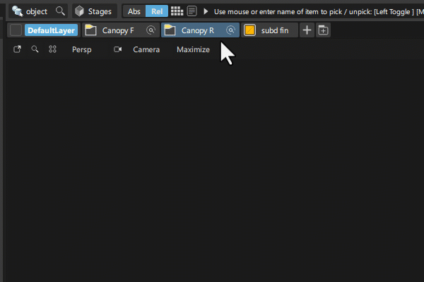

---
# You can also start simply with 'default'
theme: dracula
# random image from a curated Unsplash collection by Anthony
# like them? see https://unsplash.com/collections/94734566/slidev
layout: image
image: ./assets/title-slide.png
# some information about your slides (markdown enabled)
title: The Great Migration
info: |
  QtWS 2025: The Great Migration
# apply unocss classes to the current slide
class: text-center
# https://sli.dev/features/drawing
drawings:
  persist: false
# slide transition: https://sli.dev/guide/animations.html#slide-transitions
transition: slide-left
# enable MDC Syntax: https://sli.dev/features/mdc
mdc: true
# open graph
# seoMeta:
#  ogImage: https://cover.sli.dev
---

<style>
.slidev-code {
    height: 90%;
    overflow-y: scroll;
}
</style>

<!--
- The declaration of a `SymbolTableModel` is also a contract that designers can easily see without
  getting into C++.
-->

---

# Links

- Autodesk Alias [blogs.autodesk.com/design-studio/](https://blogs.autodesk.com/design-studio/)
- Furkanzmc [@Github](https://github.com/Furkanzmc)
- [zmc.space/](https://zmc.space)

---

# What is Alias?

<SlidevVideo autoplay controls>
    <source src="/assets/what-is-alias.mp4" type="video/mp4">
</SlidevVideo>

---

# Prologue

- Migrating legacy GUI to Qt/QML
- Pure QML/Qt Quick GUI implementation
- Lots and lots of data to transfer to GUI and back
- Extensive use of an internal data structure that we cannot change
> Refer to [QtWS 2023: Porting a Large Scale Non-Qt Legacy CAD Application to Qt/QML: The Good, The
> Bad, and The Ugly](https://www.youtube.com/watch?v=7Omr6hlxEhY) for details.

<!--
- The project took 5 years to complete.
- Refer to my other talk for details.
-->

---

# What are the problems we are trying to solve?

- Code bloat
- Developer productivity
- Dependencies
> Ideally, we want to be able to run GUI without the underlying system
- System inflexibility
- Developer focused GUI development

<!--
- The goal is to make sure that we are not constrained by our architecture, and UX can go crazy with
  whatever they want to do.
-->

---

# What is the dream?

- Maximum freedom for designing new user experiences
- Make our system more configurable
- Remove developers as a bottleneck for UX improvements

---
layout: center
---

# What this looks like in practice...

---
layout: center
---

<div class="grid grid-cols-2 gap-2">
  <div>
    
  </div>
  <div>
    
  </div>
</div>

<!--
- Uses the same data source as our menus in a different way
-->

---
layout: center
---

<div class="grid grid-cols-2 gap-2">
  <div>
    
  </div>
  <div>
    <SlidevVideo autoplay controls>
        <source src="/assets/alias-editors.mp4" type="video/mp4">
    </SlidevVideo>
  </div>
</div>

---

<SlidevVideo autoplay controls>
    <source src="/assets/alias-classic-vs-modern.mp4" type="video/mp4">
</SlidevVideo>

---
layout: image
image: ./assets/come-on-loosen-up.gif
backgroundSize: 40%
---

<!--
- In order to achieve those results, we need to loosen up our system.
-->

---
layout: center
---

# How do we represent data?

---

# Data Representation in the Core

- A `Symbol` is like `QProperty`, a `SymbolTable` is like a `QVariantMap`.

```cpp
// NOTE: Crude representation
SymbolTable data{
    {"degrees", IntSymbol{}},
    {"spans", IntSymbol{}},
    {"value", StringSymbol{}},
    {"calculate", FunctionSymbol{[]() {}}},
};
```

<v-click>

- Data for UI is created procedurally in lots of different places.
```cpp
void create() {
  // NOTE: Also code we cannot change.
  ControlBox box;
  box.addInt(IntegerSymbol{}, "Degrees"); // Represents an integer input field
  box.addInt(IntegerSymbol{}, "Spans");
  box.addSring(StringSymbol{}, "Value"); // Represents a string input field
  box.addSring(FunctionSymbol{[]() {}}, "calculate");
  box.open();
}
```

</v-click>

<!--
- Our goal is to somehow get all this data into the UI.
-->

---

# Challenge

- Get all this information to the GUI

---

# Initial Attempt


---
layout: center
---

```cpp
class Core::MyEditor {
  virtual void open() = 0;
  virtual void close() = 0;
  std::string getData() const;
  void setData(const std::string &data);
};
```

<br>

```cpp
class UI::MyEditor : public Core::MyEditor {
  void open() final {}
  void close() final {};
  QString getQData() const;
  void setQData(const QString &data);
  QVector<ControlBase *> controls() const;
  // Used whenever we had non-standard editor or data to expose.
  QQmlPropertyMap dynamicProperties() const;
};
```

<!--
- When we needed to expose data to UI, we needed to have a class that inherits from the core and
  exposes it.
- We used `QQmlPropertyMap` as well.
-->

---
layout: center
---

```cpp
class ControlColor : public ControlBase {
  Q_PROPERTY(QColor value READ getValue WRITE setValue NOTIFY valueChanged)

public:
  ControlColor(TripleSymbol *symbol, const char *title);
  QColor getValue() const;
  void setValue(QColor val);

signals:
  void valueChanged();

private:
  TripleSymbol *m_sym{nullptr};
  QColor m_color{};
};
```

---

# Model/View For UI Controls

```qml
Editor {
    property var editorData

    Repeater {
        model: editorData.controls
        delegate: Loader {
            // Information is lost...
            property var modelData

            // Information is still lost...
            property ControlBase modelData

            // One of many possibilities...
            sourceComponent: ColorEditDelegate {
                color: modelData.value
            }
        }
    }
}
```

---

# Getting Additional Data from an Editor

```qml
Editor {
    property var editorData

    // `dynamicProperties` is a `QQmlPropertyMap`
    customProperty: editorData.dynamicProperties.customData
    secondTitle: editorData.dynamicProperties.secondTitle
}
```

---

What happens when we want to call a function from our data table?

<v-click>

```cpp
Q_INVOKABLE void calculate() { m_functionSymbol.invoke(); }

// Or we cal into some virtual method that calls the underlying function symbol
Q_INVOKABLE void calculate() { calculateInternal(); }
```

</v-click>

<v-click>

What happens when you want to just arbitrarily expose function symbols?..

</v-click>

<v-click>

```cpp
Q_INVOKABLE void notFun1() {}
Q_INVOKABLE void notFun2() {}
Q_INVOKABLE void notFun3() {}
Q_INVOKABLE void notFun4() {}
```

</v-click>

<v-click>

What happens when requirements change and we need to expose different things?

</v-click>

<v-click>

```cpp
class ControlColor : public ControlBase {
  // ...
  Q_PROPERTY(float newData READ getNewData WRITE setNewData NOTIFY newDataChanged)
};
```

And recompile...

</v-click>

<!--
- We want to do as much work as possible in the core, all the logic stays there. Including opening
  dialogs, updating properties etc.
-->

---

# Cons

- It's hard to use static types
> We have to rely on `var` property type
- Each change requires a re-build in multiple units
- Lots of virtual interfaces...
- Code bloat
- Function calls has to be converted to `Q_INVOKABLE` methods

<br>

<v-click>

# Pros

- It's C++?..

</v-click>

---

# Realization...

---
layout: center
---


---

# Other Realizations

- Our GUI data is JSON-like
- Too much boilerplate code to expose data
- Virtual interfaces create a dependency that we don't like
- These data types are generic, what they represent just changes based on context
- We want to control all the data flow from a single point

<!--
- Ideally, we want to be able to run the GUI without any core involvement at all.
- So that we can run Alias faster with mock data.
-->

---

# Enter `QMetaObject` "Abuse"

```cpp
// What our data looks like...
SymbolTable data{
    {"spans", IntSymbol{-1}},
    {"faceColor", TuiTripleSymbol{255, 132, 132}},
    {"value", StringSymbol{"Timmy!"}},
    {"greet", FunctionSymbol{[]() { std::clog << "Hello all!\n"; }}},
    {"menu", SymbolTable{/* Data that represents menu items */}},
};
```

<v-click>

````md magic-move
```qml
// We have all the types we need in the QML type system
SymbolTableModel {
    property int number
    property string str
    property color colorType
    property point position
    // And also the ability for custom value types and object types.
    property myCustomPoint customPosition
    property MyCustomObject customObject
}
```
```qml
SymbolTableModel {
    property color faceColor
    property int spans
    property string value
    property var greet: () => {}
    property function greet: () => {} // Will be possible at some point... QTBUG-104220
    property Menu menu

    Component.onCompleted: {
        console.log(degrees) // Prints "32"
        console.log(spans) // Prints "-1"
        console.log(value) // Prints "Timmy!"
        greet() // Prints "Hello all!"
    }
}
```
````

</v-click>

---

Refresher...

<SlidevVideo autoplay controls>
    <source src="/assets/alias-editors.mp4" type="video/mp4">
</SlidevVideo>

---

Here's the data we use to draw those shader balls.

````md magic-move
```qml
SymbolTableModel {
    property int width
    property int height
    property bool viewEnabled
    property SymbolTable drawLayers
    property SymbolTableList items
    property SymbolTable mouse
}
```
```qml
// We can just declare what we want to use.
// Maybe used to visualize a disabled state in another control
SymbolTableModel {
    property int width
    property int height
    property bool viewEnabled
}
```
```qml
SymbolTableModel {
    // Or add more that didn't exist before
    property string title
    property int width
    property int height
    property bool viewEnabled
    property SymbolTable drawLayers
    property SymbolTableList items
    property SymbolTable mouse
}
```
````

---

**Supports inheritance**

```qml

// BaseControl.qml
SymbolTableModel {
    property string title: ""
    property string type: ""
}

// CustomControl.qml
BaseControl {
    property int counter: 0
}
```

---

**Supports all built-int types and more...**

```qml

// BaseControl.qml
SymbolTableModel {
    // Property declarations for all QML types
    property int number
    property real floatingPoint
    property string str
    property size size
    property rect rectangle
    property point position
    // ...
}
```

---

**Ability to play with syntax to make exposing data more ergonomic**

````md magic-move
```qml
SymbolTableModel {
    id: model

    property SymbolTable view
}

SymbolTableModel {
    property int width
    property int height
    property SymbolTable drawLayers

    table: model.view
}
```
```qml
SymbolTableModel {
    property SymbolTableModel view: SymbolTableModel {
        property int width
        property int height
        property SymbolTable drawLayers
    }
}
```
````

<v-click>

Ability to customize the underlying mechanics of how data is exposed.

```qml
SymbolTableModel {
    // This will create our special `ControlTableList` type internally and append `SymbolTable` types
    // to it.
    property ControlTableList controls
}
```

We use `ControlTableList` to dynamically filter our model based on some conditions.

</v-click>

---

The way the underlying data is expressed is fully customizable.

```qml
SymbolTableModel {
    property Person manager: Person {
        property string name
        // And other related properties...
    }
}
```

---
layout: center
---

# How Does It Work?

---

````md magic-move
```cpp
class SymbolTableModel : public QObject, public QQmlParserStatus {
};
```
```cpp
class SymbolTableModel : public QObject, public QQmlParserStatus {
  // `SymbolTableProxy` is a just a simple wrapper for our symbol table type.
  Q_PROPERTY(SymbolTableProxy* table ... )

  explicit SymbolTableModel(QObject *parent = nullptr);
};
```
```cpp
class SymbolTableModel : public QObject, public QQmlParserStatus {
  Q_PROPERTY(SymbolTableProxy* table ... )

  explicit SymbolTableModel(QObject *parent = nullptr);

  void componentComplete() override final;

  SymbolTableProxy *table() const;
  bool initialized() const;

private:
  void initializeProperties();
  void deinitializeProperties();
  void disconnectProperties();
};
```
````

---

````md magic-move
```cpp
class SymbolPropertyBindingBase {};
```
```cpp
class SymbolPropertyBinding : public SymbolPropertyBindingBase {};
```
```cpp
class SymbolPropertyBinding : public SymbolPropertyBindingBase {};
class SymbolTablePropertyBinding : public SymbolPropertyBindingBase {};
```
```cpp
class SymbolPropertyBinding : public SymbolPropertyBindingBase {};
class SymbolTablePropertyBinding : public SymbolPropertyBindingBase {};
class SymbolSignalBinding : public SymbolPropertyBindingBase {};
```
```cpp
class SymbolPropertyBinding : public SymbolPropertyBindingBase {};
class SymbolTablePropertyBinding : public SymbolPropertyBindingBase {};
class SymbolSignalBinding : public SymbolPropertyBindingBase {};

// Special class for executing functions
class QMLFunctionSymbolExecutor : public QObject { };
```
````

---

```cpp
void SymbolTableModel::componentComplete() {
  // Makes sure that the changes that are made to the table are propagated to the QML properties.
  initTableListener();

  if (m_tableProxy) {
    initializeProperties();
  }

  // Handle object destruction so that we don't have live bindings as
  // `SymbolTableModel` is being destroyed.
}
```

---

```cpp
void SymbolTableModel::initializeProperties() {
  for (const QMetaMethod &method : *m_methodCache.get()) {
    auto symbol = table->findSymbol(method.name().data());
    // Bind the QML signals to function symbols...
  }

  for (const QMetaProperty &property : *m_propertyCache.get()) {
    // Bind the properties to symbols.
    // These could be primitive types or custom types.
  }

  m_tableProxy->get()->foreachSymTable([this](auto table) {
    // Bind the tables to any custom type declared in the QML side.
  });

  // Sync all the bindings so the initial values are the same
  syncBinding(*pair.second);
}
```

---

```cpp
void SymbolTableModel::initTableListener() {
  m_tableListener->sigChanged.connect(
      this, [&self = *this, &propertyCache = *m_propertyCache.get(),
             &methodCache = *m_methodCache.get()](Change change) {
        if (change.type == ModType::TableAdded ||
            change.type == ModType::TableInserted) {
          // Find the associated table and update the values in QML
          // These tables might be represented as abstract list models, so we
          // get granular updates.
        } else if (change.type == ModType::TableRemoved) {
          // Remove an existing binding and clean up.
        } else if (change.type == ModType::TableReset) {
          // The table has been reset to a new state, re-initialize everything.
        } else if (change.type == ModType::TablesCleared) {
          // Clear all the values in QML side.
        } else if (change.type == ModType::SymbolAdded) {
          // Special handling for different types...
        } else if (change.type == ModType::SymbolRemoved) {
          // Invalidate existing bindings and clean up
        } else if (change.type == ModType::SymbolsCleared) {
          // Similar to `ModType::TablesCleared`
        }
      });
}
```

---

````md magic-move
```cpp
if (symbolType == TuiSymbol::Type::UI_FUNCTION_SYMBOL) {
}
```
```cpp
if (symbolType == TuiSymbol::Type::UI_FUNCTION_SYMBOL) {
  // NOTE: `obj` is `QMLFunctionSymbolExecutor` instance
  QJSValue function =
      engine->evaluate("(function(obj) { return (function() { "
                       "let args = [];"
                       "for (let i = 0; i < arguments.length; i++) {"
                       " args.push(arguments[i])"
                       "};"
                       "return this.call(args); }).bind(obj) })");
  assert(function.isCallable());
}
```
```cpp
if (symbolType == TuiSymbol::Type::UI_FUNCTION_SYMBOL) {
  // NOTE: `obj` is `QMLFunctionSymbolExecutor` instance
  QJSValue function =
      engine->evaluate("(function(obj) { return (function() { "
                       "let args = [];"
                       "for (let i = 0; i < arguments.length; i++) {"
                       " args.push(arguments[i])"
                       "};"
                       "return this.call(args); }).bind(obj) })");
  assert(function.isCallable());

  QJSValue boundFunction = function.call(
      QJSValueList{engine->toScriptValue(new QMLFunctionSymbolExecutor{
          static_cast<const TuiFunctionSymbol *>(&symbol),
          const_cast<QObject &>(obj)})});
  assert(boundFunction.isCallable());
}
```
```cpp
if (symbolType == TuiSymbol::Type::UI_FUNCTION_SYMBOL) {
  // NOTE: `obj` is `QMLFunctionSymbolExecutor` instance
  QJSValue function =
      engine->evaluate("(function(obj) { return (function() { "
                       "let args = [];"
                       "for (let i = 0; i < arguments.length; i++) {"
                       " args.push(arguments[i])"
                       "};"
                       "return this.call(args); }).bind(obj) })");
  assert(function.isCallable());

  QJSValue boundFunction = function.call(
      QJSValueList{engine->toScriptValue(new QMLFunctionSymbolExecutor{
          static_cast<const TuiFunctionSymbol *>(&symbol),
          const_cast<QObject &>(obj)})});
  assert(boundFunction.isCallable());

  return QVariant::fromValue<QJSValue>(boundFunction);
}
```
````

---

```qml {1-3,10|1-6,9,10|all}
SymbolTableModel {
    property var calculateThings: () => {} // Syntax sugar
    property var getSomeValue

    Component.onCompleted: {
        calculateThings()
        // Functions can also have return values!
        const value = getSomeValue()
    }
}
```

---


<v-click>

````md magic-move
```cpp
// SomeWhereOverTheRainbow.cpp
symbol.notify();
```
```cpp
// SomeWhereOverTheRainbow.cpp
symbol.notify();

// SymbolTableModel.cpp
symbol.sigModified.connect(this, [](...) {
    // The change is handled and the associated `QProperty` is updated.
})
```
````

</v-click>

<v-click>

```qml
SymbolTableModel {
    property int symbol

    onSymbolChanged: {
        console.log("Property value changed")
    }
}
```

</v-click>

---

<SlidevVideo autoplay controls>
    <source src="/assets/object-lister-information-window.mov" type="video/mp4">
</SlidevVideo>

---

# Where do we go from here?

- No performance issues yet, we are on the look out for potential bottlenecks
> For example:
> - Executing JS is expensive, so we cache what we can for each `QJSEngine`
- Look into QML compiler extension to see how this would work
- Make introspection and debugging easier

---
layout: center
---

# Bonus Content!

Docking implementation in Qt Quick/QML.

---

<SlidevVideo autoplay controls>
    <source src="/assets/docking-video.mp4" type="video/mp4">
</SlidevVideo>

---

# High Level Features

- Fully customizable
> Customization for which window can be docked is done through attached type.
- Data driven
> Easy to save and restore docking configurations
- Flexible
> Docking layout is done with a positioner that can be customized

---


---

# Declarative Support

```qml
MainDockController {
    DockController {
        location: DockController.Left
        model: DockingGroupModel {
            DockingGroupData {}
        }
    }

    // Multiple `DockController`s can be docked to each side.
    DockController {
        location: DockController.Left
        model: DockingGroupModel {
            DockingGroupData {}
        }
    }
}
```

---

# High Customization

```qml
MainDockController {
    dockControllerDelegate: DockController {
        // This allows for all sorts of design choices and customizations.
    }
    layoutDelegate: DockingLayout {}
    placeholder: Rectangle {}
    // Customization for where the drop zones are for docking.
    hotspots: [HotSpot {}]
    floatingWindowDelegate: MyCustomWindow {}
}
```

---

```qml
DockController {
    contentItem: DockingLayout {
        // Can be customized for special ways of positioning `DockingGroup`s
    }
    dockingGroupDelegate: DockingGroup {
        // Can be customized to provide details for the layout through attached types
        // And also for additional bells and whistles for specific actions.
    }
    // You could add a title bar, additional affordance for specific actions (Collapse/expand/hide
    // etc)
}
```

---

```qml
DockingGroup {
    placeholder: Rectangle {}
    hotspots: [HotSpot{}]

    // You could add a tab bar to represent the windows inside the group
    TabBar {}
    // Or any other custom item you want!
    StackView {}
}
```

---

```qml
QtQuick.Window {
    // `Docking` is the attached type used to customize docking behaviour.
    Docking.windowName: "window_identifier"
    Docking.contentItem: conItem
    Docking.title: root.title
    Docking.enabled: !isModal && root.dockable
    Docking.onDocked: { }
    Docking.onUndocked: { }
    Docking.onAttached: { }
    Docking.onDetached: { }
}
```

---

# Pain points

- Window management
- Event redirection
- `Item` size management
- Things happening "out of order"

---
layout: image
image: ./assets/thank-you-slide.png
---
